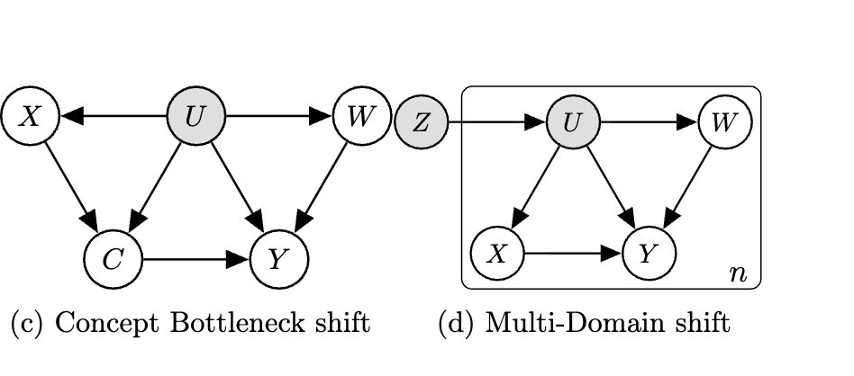

*In AISTATS 2023.*

## Abstract

We address the problem of unsupervised domain adaptation when the source domain differs from the target domain because of a shift in the distribution of a latent subgroup. When this subgroup confounds all observed data, neither covariate shift nor label shift assumptions apply. We show that the optimal target predictor can be non-parametrically identified with the help of concept and proxy variables available only in the source domain, and unlabeled data from the target. The identification results are constructive, immediately suggesting an algorithm for estimating the optimal predictor in the target. For continuous observations, when this algorithm becomes impractical, we propose a latent variable model specific to the data generation process at hand. We show how the approach degrades as the size of the shift changes, and verify that it outperforms both covariate and label shift adjustment.

{fig-alt="Adaptation methods comparison"}

Our adaptation methods (LSA-WAE-S and Spectral) mitigate the performance degradation caused by increasing distribution shift, especially when the proxy variable has low noise (higher alpha_w).

## Handling Hidden Shifts in Data: A New Strategy for Adaptation

One of the most persistent challenges in deploying machine learning models in the real world is distribution shift. A model trained in one environment---a "source" domain---often fails when applied to a new "target" domain. Consider a model trained to predict patient outcomes using data from Hospital P. When we try to use this model at Hospital Q, its performance may plummet because the two hospitals serve different patient populations, with underlying differences in demographics, socioeconomic status, and patterns of care.

This is the classic problem of unsupervised domain adaptation. Standard approaches often assume the shift is simple. Covariate shift assumes that while the features (X) change, the relationship between features and labels, p(Y|X), remains the same. Label shift assumes the label distribution p(Y) changes, but the conditional feature distribution p(X|Y) is stable.

But what happens when the shift is more complex? What if the patient populations in both hospitals are mixtures of underlying, unobserved subgroups (e.g., based on social determinants of health), and it's the prevalence of these subgroups that differs? In this scenario, which we call latent subgroup shift, neither the covariate nor the label shift assumption holds, rendering standard methods ineffective.

We tackle this problem head-on. We show that even when the shifting subgroup is unobserved, we can still successfully adapt a model from the source to the target domain by leveraging other forms of auxiliary data.

## Our Approach: Finding a Foothold with Concepts and Proxies

Our core insight is that the optimal predictor in the target domain, q(Y∣X), can be mathematically identified if we have access to two special types of variables only in the source domain:

**Concepts (C)**: These are high-level, often interpretable variables that mediate the relationship between low-level features and the final label. In our hospital example, the raw electronic health record data would be the features (X), and a physician's summary notes about the presence of infection could serve as the concept (C), which in turn informs the final diagnosis (Y).

**Proxies (W)**: This is a variable that serves as a noisy measurement of the unobserved subgroup (U) but is otherwise independent of the other variables, conditional on U. For instance, a patient's residential area (W) could act as a proxy for their unmeasured socioeconomic status (U).

We can also anchor to having access to multiple domains --- see our follow-up paper: [Proxy Methods for Domain Adaptation](https://arxiv.org/abs/2403.07442).

The causal relationships we assume are shown in the graph below.

## The Theoretical Payoff: A Path to Identification

Our main theoretical contribution is a formal proof that q(Y∣X) is non-parametrically identifiable using only labeled source data (containing X, Y, C, W) and unlabeled target data (containing only X).

This identification is constructive, meaning the proof itself outlines a recipe for estimation. The strategy involves an adjustment formula that corrects for the shift in the latent subgroup U. While U is unobserved, we show that we can recover its influence by leveraging the unique conditional independence properties of the concept and proxy variables. This is achieved through a series of matrix operations and eigendecompositions that disentangle the contributions of the latent subgroups from the observable data.

## Making It Practical: From Theory to Estimation

The direct plug-in estimator suggested by our proof works for discrete data but can be impractical for high-dimensional, continuous problems. To address this, we propose an alternative approach using a deep latent variable model---specifically, a Wasserstein Auto-Encoder (WAE).

Crucially, we don't use a standard WAE. We structure our model's decoder to explicitly reflect the factorization implied by our causal graph. By embedding our structural assumptions into the model architecture, we encourage the WAE to learn a joint distribution that is consistent with our theory, allowing for effective estimation of the quantities needed for adaptation.

## Putting It to the Test

We validated our approach through a series of simulation studies. Our results show that:

Our proposed method significantly outperforms standard baselines, including ERM, covariate shift, and label shift adjustment, which often fail in the latent subgroup shift setting.

The WAE that was structured to match our causal assumptions (LSA-WAE-S) successfully adapted to the target domain, closing much of the performance gap between the source-only model and an oracle model trained on labeled target data.

An unstructured, vanilla WAE (LSA-WAE-V) failed to improve over the baseline, highlighting that the performance boost comes from correctly leveraging the assumed causal structure.

## Why This Matters

This work provides a formal identification strategy and a practical estimation framework for a challenging and realistic type of distribution shift that has previously been difficult to address. It demonstrates how ideas from causal inference (proximal learning), concept-based models, and label shift adaptation can be unified into a powerful new approach. Ultimately, our findings motivate the careful collection of richer data---including concepts and proxies where available---to build machine learning systems that are more robust and adaptable to the complexities of the real world.

## Interested in the details?

- Read the full paper at [arXiv:2212.11254](https://arxiv.org/pdf/2212.11254)
- Check out the implementation on [GitHub](https://github.com/google-research/google-research/tree/master/latent_shift_adaptation)

### Cite

```bibtex
@inproceedings{alabdulmohsin2023adapting,
  title={Adapting to latent subgroup shifts via concepts and proxies},
  author={Alabdulmohsin, Ibrahim and Chiou, Nicole and D'Amour, Alexander and Gretton, Arthur and Koyejo, Sanmi and Kusner, Matt J and Pfohl, Stephen R and Salaudeen, Olawale and Schrouff, Jessica and Tsai, Katherine},
  booktitle={International Conference on Artificial Intelligence and Statistics},
  pages={9637--9661},
  year={2023},
  organization={PMLR}
}
```
