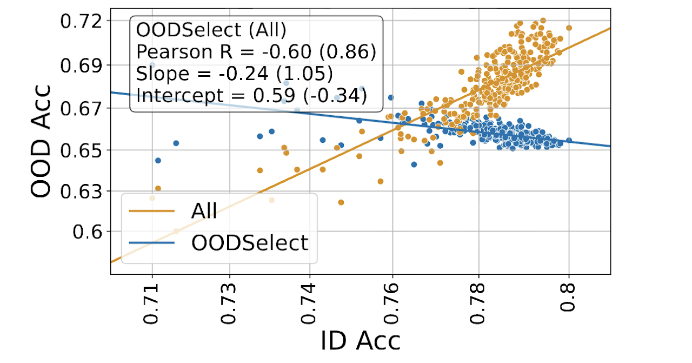

*In NeurIPS 2025. Spotlight.*

## Abstract

Benchmarks for out-of-distribution (OOD) generalization frequently show a strong positive correlation between in-distribution (ID) and OOD accuracy across models, termed "accuracy-on-the-line." This pattern is often taken to imply that spurious correlations---correlations that improve ID but reduce OOD performance---are rare in practice. We find that this positive correlation is often an artifact of aggregating heterogeneous OOD examples. Using a simple gradient-based method, OODSelect, we identify semantically coherent OOD subsets where accuracy on the line does not hold. Across widely used distribution shift benchmarks, the OODSelect uncovers subsets, sometimes up to over half of the standard OOD set, where higher ID accuracy predicts lower OOD accuracy. Our findings indicate that aggregate metrics can obscure important failure modes of OOD robustness. We release code and the identified subsets to facilitate further research.

{fig-alt="AoTL vs AoTIL comparison"}

Comparing AoTL and AoTIL. Pearson Correlation between ID and OOD accuracy as a function of the number of selected OOD samples. Correlation values above 0.3 indicate AoTL, while below -0.3 is AoTIL---correlations in between are considered weak. We compare a Random Selection of data samples and the Most Misclassified at fixed size intervals from 100 to over 100,000 (normalized to sample size in the figure). Random selections yield strong positive correlation, while misclassified samples have weak correlations; that is, our method does not conflate spurious correlations with general difficulty (e.g., label noise). OODSelect identifies subsets where ID and OOD accuracy are negatively correlated---in one case (CXR) for over 70% of the usual OOD dataset. This behavior is dataset-dependent due to differences in distributional properties.

## The Mirage of Robustness

Benchmarks for out-of-distribution (OOD) generalization often tell a comforting story: models that perform better on in-distribution data also perform better when the world changes. This "accuracy-on-the-line" trend suggests that reliability scales naturally with capability. But when we look more closely, this neat relationship begins to unravel.

In our NeurIPS 2025 paper, we introduce OODSelect, a simple method that reveals how aggregate reliability can hide fragility. Standard OOD benchmarks often pool together many kinds of shifts---different lighting, demographics, hospitals, or environments---and treat them as one. OODSelect decomposes these mixtures into semantically coherent subsets and measures how in-distribution accuracy relates to OOD performance within each. Across widely used benchmarks, we find that the positive correlation breaks down in up to half of the data: in some subsets, models that perform better on the training domain actually perform *worse* out of distribution.

These hidden reversals explain why benchmarks can overstate robustness and why average metrics often fail to predict real-world reliability. The result is a more diagnostic science of evaluation---one that moves beyond aggregate numbers to reveal where reliability holds, and where it collapses.

## Interested in the details?

- Read the full paper at [arXiv:2510.24884](https://arxiv.org/pdf/2510.24884)
- Check out the implementation on [GitHub](https://github.com/olawalesalaudeen/OODSELECT)

### Cite

```bibtex
@inproceedings{salaudeen2025aggregation,
  title={Aggregation Hides Out-of-Distribution Generalization Failures from Spurious Correlations},
  author={Olawale Elijah Salaudeen and Haoran Zhang and Kumail Alhamoud and Sara Beery and Marzyeh Ghassemi},
  booktitle={Advances in Neural Information Processing Systems},
  year={2025}
}
```
