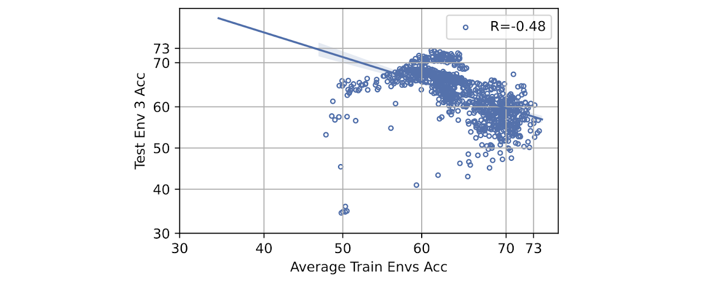

*In TMLR 2025. TMLR Journal to Conference Certification.*

*A version ([On Domain Generalization Datasets as Proxy Benchmarks for Causal Representation Learning](https://openreview.net/forum?id=LbFK9pUlA5)) was presented as an Oral Presentation at the NeurIPS 2024 Causal Representation Learning Workshop.*

## Abstract

Spurious correlations are unstable statistical associations that hinder robust decision-making. Conventional wisdom suggests that models relying on such correlations will fail to generalize out-of-distribution (OOD), particularly under strong distribution shifts. However, a growing body of empirical evidence challenges this view, as naive in-distribution empirical risk minimizers often achieve the best OOD accuracy across popular OOD generalization benchmarks. In light of these counterintuitive results, we propose a different perspective: many widely used benchmarks for assessing the impact of removing spurious correlations on OOD generalization are misspecified. Specifically, they fail to include shifts in spurious correlations that meaningfully degrade OOD generalization, making them unsuitable for evaluating the benefits of removing such correlations. Consequently, we establish conditions under which a distribution shift can reliably assess a model's reliance on spurious correlations. Crucially, under these conditions, we provably should not observe a strong positive correlation between in-distribution and out-of-distribution accuracy---often referred to as accuracy on the line. Yet, when we examine state-of-the-art OOD generalization benchmarks, we find that most exhibit accuracy on the line, suggesting they do not effectively assess robustness to spurious correlations. Our findings expose a limitation in current benchmarks evaluating algorithms for domain generalization, i.e., learning predictors that do not rely on spurious correlations. Our results (i) highlight the need to rethink how we assess robustness to spurious correlations, (ii) identify existing well-specified benchmarks the field should prioritize, and (iii) enumerate strategies to ensure future benchmarks are well-specified.

{fig-alt="Accuracy on the line across benchmarks"}

ColoredMNIST (Env 2, R=-0.74)

Covid-CXR (Env 3, R=-0.48)

CivilComments (Env 1, R=-0.47)

Waterbirds (Env 0, R=-0.06)

Camelyon (Env 2, R=0.78)

PACS (Env 0, R=0.98)

Real-world benchmarks exhibiting varying degrees of accuracy correlation from training distribution to testing distribution, illustrating well-specified (weak or strong negative, e.g., top row) versus potentially misspecified (strong positive correlation, e.g., 3e, 3f) scenarios. Strong positive correlations suggest that no special methodology beyond empirical risk minimization is needed; hence, we cannot measure progress in developing models robust to distribution shifts since the represented distribution shift is benign.

## Rethinking Robustness: Are Our AI Benchmarks Asking the Right Questions?

In the quest for artificial intelligence that we can trust in the real world, the goal of "domain generalization" is paramount. We aim to build models that can perform reliably when faced with new, unseen environments---a critical capability for applications from medical diagnostics to autonomous driving. A key obstacle is the problem of "spurious correlations," where models learn to rely on incidental features in the training data that are not truly related to the task.

A classic example is a model trained to diagnose disease from chest X-rays. If the training data comes from different hospitals, the model might learn that a specific marker placed on the X-ray by one hospital's machine is a strong predictor of disease, simply because that hospital treats sicker patients. This model fails when deployed to a new hospital that doesn't use that marker. The model learned a shortcut, not the actual pathology.

To combat this, the field has developed specialized algorithms designed to ignore these spurious patterns. Yet, a puzzling trend has emerged: on many popular benchmarks, standard models that are *supposed* to be vulnerable to these shortcuts often achieve the best out-of-distribution (OOD) performance. Furthermore, many of these benchmarks exhibit "accuracy on the line"---a strong, positive correlation where models that do better on the training data also do better on the OOD data.

This paradox has led some to question the necessity of targeted algorithms for domain generalization. In our work, we propose an alternative and fundamentally different perspective: **The problem may not be with the algorithms, but with the benchmarks themselves.**

## What Makes a Good Benchmark?

We argue that many widely-used benchmarks are *misspecified*---they fail to create the conditions necessary to actually test for robustness. We propose a formal definition for a "well-specified" benchmark:

> "A benchmark is well-specified if and only if a model relying exclusively on stable, domain-general features achieves better out-of-distribution performance than a model that exploits spurious features."

For a benchmark to meet this standard, it must do more than just present data from a different domain. Our primary theoretical result shows that it must introduce a **sufficient reversal** in the spurious correlations between the training (ID) and testing (OOD) data. In other words, the shortcut that worked for the training data must become actively misleading in the test data. Only then is there a clear penalty for relying on it.

## The Fundamental Conflict: Well-Specified Benchmarks vs. "Accuracy on the Line"

This leads to our second key theoretical insight: a benchmark that is well-specified and a benchmark that exhibits "accuracy on the line" are **provably at odds**. Our analysis shows that the set of data shifts that satisfy both conditions simultaneously has a probability of zero.

Intuitively, as the correlation between in-distribution and out-of-distribution accuracy gets stronger, the probability that the benchmark is actually testing for robustness vanishes. This provides a powerful test: **if a benchmark shows strong, positive "accuracy on the line," it is likely misspecified for evaluating domain generalization.**

## A Reality Check of Real-World Benchmarks

We put this theory to the test by analyzing hundreds of thousands of models over 40 ID/OOD data splits across popular, state-of-the-art benchmarks, including PACS, Waterbirds, Covid-CXR, and WILDSCamelyon. Our findings reveal a sharp divide:

- **Potentially Misspecified**: Many benchmarks, such as PACS and WILDSFMOW, show a strong positive correlation between ID and OOD accuracy, suggesting they do not effectively penalize models for using spurious features.
- **Well-Specified**: In contrast, certain splits of other benchmarks, like ColoredMNIST, Covid-CXR, and Waterbirds, show the desired weak or negative correlation. These are the benchmarks that provide a meaningful signal about a model's robustness.

## Practical Implications for AI Research

Our findings have crucial implications for the research community:

1. **Prioritize Well-Specified Benchmarks**: Researchers should prioritize evaluation on benchmarks and specific data splits that are shown to be well-specified (i.e., those without strong positive "accuracy on the line").
2. **Avoid Blindly Averaging Results**: Averaging results across many different datasets or ID/OOD splits can hide critical information and dilute the reliability of an evaluation, especially if some or most splits are misspecified.
3. **Rethink Model Selection**: Using held-out accuracy alone to select the "best" model can inadvertently favor models that rely on spurious shortcuts.

By critically re-evaluating our benchmarks, we can pave a clearer path toward developing models that are truly robust to spurious correlations and reliable when deployed under real-world distribution shifts. This work takes a vital step toward resolving ambiguity in robustness evaluation, enabling more meaningful progress for the entire field.

## Interested in the details?

- Read the full paper at [arXiv:2504.00186](https://arxiv.org/pdf/2504.00186)
- Check out the implementation on [GitHub](https://github.com/olawalesalaudeen/misspecified_DG_benchmarks)
- Interactive visualization tool [here](https://misspecified-dg-benchmarks-viz.streamlit.app/)

### Cite

```bibtex
@article{salaudeen2025domain,
  title={Are Domain Generalization Benchmarks with Accuracy on the Line Misspecified?},
  author={Salaudeen, Olawale and Chiou, Nicole and Weng, Shiny and Koyejo, Sanmi},
  journal={arXiv preprint arXiv:2504.00186},
  year={2025}
}
```
