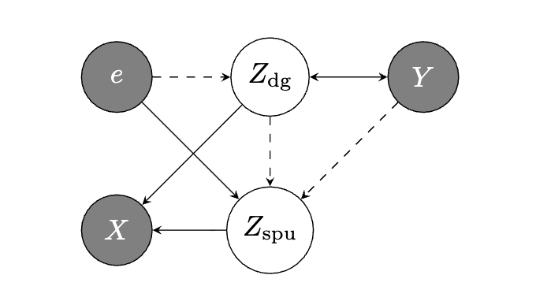

*In AISTATS 2024.*

## Abstract

Given a causal graph representing the data-generating process shared across different domains/distributions, enforcing sufficient graph-implied conditional independencies can identify domain-general (non-spurious) feature representations. For the standard input-output predictive setting, we categorize the set of graphs considered in the literature into two distinct groups: (i) those in which the empirical risk minimizer across training domains gives domain-general representations and (ii) those where it does not. For the latter case (ii), we propose a novel framework with regularizations, which we demonstrate are sufficient for identifying domain-general feature representations without a priori knowledge (or proxies) of the spurious features. Empirically, our proposed method is effective for both (semi)synthetic and real-world data, outperforming other state-of-the-art methods in average and worst-domain transfer accuracy.

{fig-alt="TCRI framework overview"}

## Beyond Pattern Matching: Teaching AI to Ignore Spurious Correlations

In our quest to build intelligent systems, one of the biggest hurdles is creating AI that can generalize. We want models that don't just perform well on the data they were trained on, but can reliably handle new, unseen situations. This is crucial for real-world applications where the stakes are high. For example, an autonomous vehicle must be resilient to unfamiliar conditions, and a medical diagnostic tool must perform consistently across different hospital systems, machines, and patient populations.

The problem is that AI models are exceptional pattern matchers, but they can easily learn the wrong patterns. They often pick up on "spurious correlations"---shortcuts in the training data that are associated with the correct label but aren't generally related to it.

Imagine an AI trained to detect pneumonia from chest X-rays. The training data comes from multiple hospitals. It turns out that sicker patients, who are more likely to have pneumonia, are often scanned with a portable X-ray machine at their bedside. These portable machines leave specific markings on the image. A standard AI model quickly learns that the presence of the token is a great predictor for pneumonia, instead of learning the actual, subtle signs of disease in the lungs. This model works great on the training data, but it fails catastrophically when deployed in a new hospital that doesn't have those markings, or even when the original hospital updates its equipment. <a href="https://journals.plos.org/plosmedicine/article?id=10.1371/journal.pmed.1002683">[[source]]</a>

A constructed example we can analyze is the ColoredMNIST dataset. In this dataset, most images of digits 0-4 are colored red, and most images of digits 5-9 are colored green. A standard model quickly learns that "green" is a great predictor for "digits 5-9" instead of learning the actual shapes of the digits. This model works great on the training data, but it fails catastrophically in a new domain where the color-label association is flipped or removed. Clearly, the digit features are the more stable features we'd like the model to learn.

Existing methods like Invariant Risk Minimization (IRM) have tried to solve this by searching for predictive features that work across all training domains. However, these approaches often rely on strong assumptions and don't always deliver in practice.

In our work, we introduce a new framework that takes a different approach. Instead of just searching for what's invariant, we use the lens of causality to actively separate the robust, domain-general features from the spurious, domain-specific ones.

## Our Approach: Forcing a Separation of Features

Our key idea is to design a model that is explicitly forced to disentangle the underlying features. We do this by training two separate feature extractors simultaneously:

**A domain-general extractor (Φ_dg)**, which is tasked with capturing the true, causal features (e.g., the biological signs of pneumonia in the lungs, or digit features in ColoredMNIST). A predictor that is shared across domains is based on this feature extractor.

**A spurious extractor (Φ_spu)**, which is designed to capture the domain-specific, non-causal features (e.g., the presence of a hospital's specific token, or color in ColoredMNIST). Each domain has a unique predictor that is based on a concatenation of the domain-general and spurious feature extractor, so that spurious correlations, which can be used here to improve domain-specific performance, are available for our regularization below.

During training, we enforce two critical constraints on these extractors:

**Total Information Criterion (TIC)**: Together, the two extractors must capture all the information in the input that is relevant for predicting the label. We don't want to lose any predictive power; we just want to organize it.

**Target-Conditioned Representation Independence (TCRI)**: This is our secret sauce. We enforce that the features from the domain-general extractor must be statistically independent from the features from the spurious extractor, given the final label. Essentially, this means that knowing about the spurious feature (e.g., "the hospital token is present", or color in ColoredMNIST) should give you no new information about the domain-general feature (the lung pathology) if you already know the patient's diagnosis.

We show that by enforcing these two properties, our framework learns to isolate the spurious information into Φ_spu and the generalizable information into Φ_dg. Then, for inference in a new hospital or on a new machine, we simply use the domain-general extractor Φ_dg and discard the spurious one. Crucially, our method works without ever needing direct knowledge or proxies of which features are spurious, a limitation of some related previous work.

See the paper for more details.

## Putting It to the Test

To test our theory in controlled settings, we evaluated our TCRI framework on several challenging domain generalization benchmarks designed to have these kinds of spurious shortcuts, including ColoredMNIST and Spurious PACS. Spurious PACS considers spurious correlations between image styles and objects we aim to predict. We also evaluate our framework on general datasets with distribution shifts, such as Terra Incognita, which requires predicting animals in the wild across new locations and camera traps, where spurious correlations may arise due to factors like camera angle and daylight.

Our method consistently outperformed other state-of-the-art approaches at the time in average accuracy across domains and worst-domain accuracy. Improving average performance is beneficial, but enhancing the worst-case scenario is crucial for creating robust and reliable systems that we can trust. On all datasets, our method (TCRI_HSIC) achieved the highest average and worst-domain accuracy compared to all baselines.

We also confirmed that our model was working as intended. In an ablation study, removing the Total Information Criterion (TIC) caused a significant drop in performance, showing that both parts of our framework are necessary. Furthermore, by examining the domain-specific predictors, we could see that they were clearly learning the spurious correlations, while the domain-general predictor was successfully ignoring them, demonstrating a clear separation of features. See the paper for more details and results.

## The Big Picture and What's Next

Our work shows that by leveraging conditional independencies implied by causal graphs, we can successfully identify and isolate domain-general features from spurious ones. This provides a new and effective path toward building models that are more robust to shifts in data distribution.

By also considering worst-case performance, we're taking steps to ensure that future AI systems are not just accurate on average, but are also more reliable when deployed in the complex, ever-changing real world.

We are excited to build on this framework, further improving its ability to provably recover domain-general mechanisms and developing new model selection strategies tailored for domain generalization.

## Interested in the details?

- Read the full paper at [arXiv:2404.16277](https://arxiv.org/pdf/2404.16277)
- Check out the implementation on [GitHub](https://github.com/olawalesalaudeen/tcri)

### Cite

```bibtex
@inproceedings{salaudeen2024causally,
  title={Causally Inspired Regularization Enables Domain General Representations},
  author={Salaudeen, Olawale and Koyejo, Sanmi},
  booktitle={International Conference on Artificial Intelligence and Statistics},
  pages={3124--3132},
  year={2024},
  organization={PMLR}
}
```