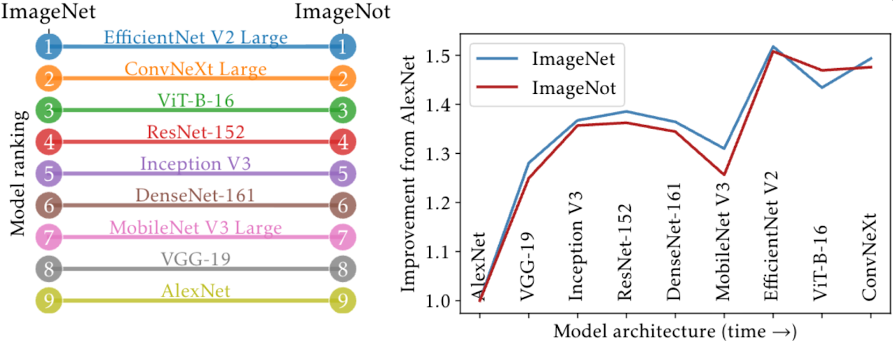

## Abstract

We introduce ImageNot, a dataset designed to match the scale of ImageNet while differing drastically in other aspects. We show that key model architectures developed for ImageNet over the years rank identically when trained and evaluated on ImageNot to how they rank on ImageNet. This is true when training models from scratch or fine-tuning them. Moreover, the relative improvements of each model over earlier models strongly correlate in both datasets. We further give evidence that ImageNot has a similar utility as ImageNet for transfer learning purposes. Our work demonstrates a surprising degree of external validity in the relative performance of image classification models. This stands in contrast with absolute accuracy numbers that typically drop sharply even under small changes to a dataset.

{fig-alt="ImageNet vs ImageNot model rankings"}

The model ranking on ImageNot (right) is identical to the ranking on ImageNet (left). The relative improvement of each model over AlexNet follows a nearly identical trajectory on both datasets.

This consistency suggests a powerful counterfactual: had ImageNot been the benchmark of the 2010s, it could have driven the very same sequence of architectural breakthroughs as ImageNet did.

## ImageNet's Surprising External Validity: Model Rankings Generalize Even When Accuracy Doesn't

A central anxiety in machine learning is the apparent fragility of our models. It's a well-documented phenomenon: models developed in one domain often perform far worse when deployed in a new one. A slew of important research has shown that even small changes to a dataset can cause a model's accuracy to plummet. This has led to a reasonable fear that the remarkable progress we've witnessed on benchmarks like ImageNet might lack external validity, leaving us to wonder if our gains are truly general or merely specific to one particular dataset.

The deep learning revolution of the 2010s was fueled by the ImageNet benchmark. Numerous groundbreaking architectures were developed with the specific goal of conquering this challenge. This begs a fundamental question: *How much of this progress was intrinsically tied to the specific properties of ImageNet?* Had a different large-scale dataset been the standard, would it have spurred the same architectural innovations?

To investigate this question of external validity, we didn't just tweak ImageNet---we created its conceptual opposite. In our work, we introduce ImageNot, a new dataset built explicitly to be drastically different from ImageNet while matching its scale.

## Building ImageNot, an 'Anti-ImageNet'

**Scale and Scope**: Like ImageNet, ImageNot has 1,000 classes with 1,000 images each. However, its classes are deliberately arbitrary, unrelated, and strictly different from those in ImageNet.

**Data Source & Labeling**: Instead of using human annotators to ensure label quality, ImageNot is sourced from noisy, web-crawled image-text pairs from the LAION-5B dataset. Images were selected based only on the similarity between their captions and class definitions, using a text-only model (RoBERTa) that was never trained on ImageNet to avoid bias.

**The Result**: A much noisier dataset where the best-performing model achieves around 60% accuracy, compared to ~85% on ImageNet. The datasets are so distinct that a standard classifier can tell them apart with 97% accuracy.

Crucially, our investigation avoids the common confounds of previous studies, which often evaluated models pre-trained on ImageNet or used datasets with the same classes or data sources. By training models from scratch on ImageNot, we can isolate the performance of the architectures themselves.

## The Surprising Result: Rankings are Remarkably Robust

After training and evaluating nine seminal model architectures---from AlexNet to ConvNeXt---on ImageNot, we found something remarkable:

**The model rankings are identical.** The order of performance on ImageNot exactly mirrors the established ranking on ImageNet. The same architectures that won on ImageNet also win on ImageNot.

**Relative improvements are preserved.** The magnitude of improvement of each model over its predecessors is strongly correlated between the two datasets. An architectural leap on ImageNet corresponds to a similarly-sized leap on ImageNot.

## What This Means for Benchmarking and AI Progress

While absolute accuracy numbers are brittle and drop sharply even under small dataset shifts, the relative performance of models appears to be a far more robust measure of progress. Our findings suggest the external validity of ImageNet as a benchmark for driving progress is significantly greater than previously assumed.

For the purpose of evaluating and comparing new architectures, a benchmark's primary function should be to produce robust model rankings. Our work suggests that to achieve this, the precise choice of classes or even the cleanliness of the labels may be less important than a dataset's sheer scale and diversity.

By constructing a dataset in stark contrast to ImageNet, we reveal that the lessons learned and progress made over the last decade are not just an artifact of one specific benchmark, but reflect a more fundamental and generalizable truth about what makes for a better image classification model.

## Interested in the details?

- Read the full paper at [arXiv:2404.02112](https://arxiv.org/pdf/2404.02112)
- Check out the implementation on [GitHub](https://github.com/olawalesalaudeen/imagenot)

### Cite

```bibtex
@article{salaudeen2024imagenot,
  title={ImageNot: A contrast with ImageNet preserves model rankings},
  author={Salaudeen, Olawale and Hardt, Moritz},
  journal={arXiv preprint arXiv:2404.02112},
  year={2024}
}
```
