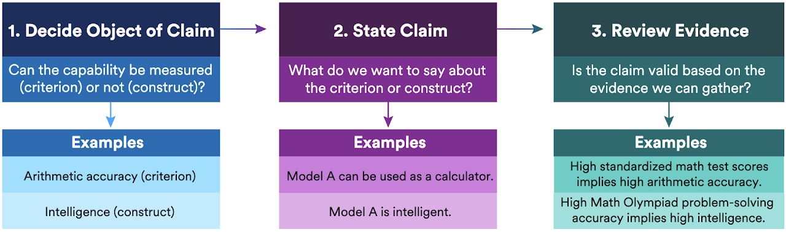

*In Review. Preliminary version accepted at the NeurIPS 2025 Workshop on Evaluating the Evolving LLM Lifecycle: Benchmarks, Emergent Abilities, and Scaling.*

## Abstract

While the capabilities and utility of AI systems have advanced, rigorous norms for evaluating these systems have lagged. Grand claims, such as models achieving general reasoning capabilities, are supported with model performance on narrow benchmarks, like performance on graduate-level exam questions, which provide a limited and potentially misleading assessment. We provide a structured approach for reasoning about the types of evaluative claims that can be made given the available evidence. For instance, our framework helps determine whether performance on a mathematical benchmark is an indication of the ability to solve problems on math tests or instead indicates a broader ability to reason. Our framework is well-suited for the contemporary paradigm in machine learning, where various stakeholders provide measurements and evaluations that downstream users use to validate their claims and decisions. At the same time, our framework also informs the construction of evaluations designed to speak to the validity of the relevant claims. By leveraging psychometrics' breakdown of validity, evaluations can prioritize the most critical facets for a given claim, improving empirical utility and decision-making efficacy. We illustrate our framework through detailed case studies of vision and language model evaluations, highlighting how explicitly considering validity strengthens the connection between evaluation evidence and the claims being made.

{fig-alt="Validity framework overview"}

## Measurement to Meaning: A Validity-Centered Framework for AI Evaluation

The AI landscape is a whirlwind of progress. New models like Claude 3.5, GPT-4o, and Gemini 1.5 are constantly setting records on benchmarks from graduate-level exams (GPQA) to coding challenges (SWE-bench). This rapid progress generates a blizzard of exciting---and often broad---claims about their capabilities, from "expert-level knowledge" to "general reasoning." But as these systems become more integrated into society, a critical question emerges: *What do these benchmark scores really mean?*

When a model aces a math test, can we claim it has achieved "mathematical reasoning," or simply that it's good at a specific type of test? The lack of rigorous norms for connecting benchmark performance to real-world capabilities has led to a crisis of interpretation, where grand claims rest on narrow evidence.

We introduce a structured and practical approach to this problem. We don't just propose another benchmark; we offer a new language of scrutiny borrowed from the mature field of psychometrics to help us understand what we can---and cannot---validly claim about AI systems.

## The Core Idea: Validity is About the Claim, Not Just the Test

Our framework is built on a fundamental concept from measurement theory: *validity*. Validity is not an inherent property of a benchmark. Instead, it refers to the degree to which evidence and theory support the specific interpretations and uses of an evaluation's results. A benchmark score might validly support a narrow claim but be completely invalid for supporting a broader one.

To navigate this, our framework guides a user through a simple but powerful decision process that starts with the claim itself.

**What is the object of your claim?** First, we must distinguish between two types of objects:

- A **Criterion**: A specific, concrete, and directly measurable capability (e.g., "accuracy on textbook linear algebra questions").
- A **Construct**: A latent, abstract trait that cannot be measured directly (e.g., "reasoning," "intelligence," or "trustworthiness").

**How are you measuring it?** The path to validation depends on the relationship between your measurement and the object of your claim. Are you measuring the criterion directly, or are you using a proxy to get at an underlying construct?

## A Framework for Evaluation

Our framework adopts a breakdown of the complex task of validation into five manageable components, providing a shared vocabulary for all stakeholders.

- **Content Validity**: Does your benchmark cover the full scope of the ability you care about?
- **Criterion Validity**: Do scores on your benchmark predict performance on a real-world "gold standard" criterion?
- **Construct Validity**: If you're claiming to measure an abstract construct like "reasoning," does your evidence show you're actually measuring it, and not just something else like memorization? This is a major challenge, often requiring a nomological network---a theoretical map of how the construct relates to other concepts and observable behaviors.
- **External Validity**: Do your findings hold true across different settings, populations, and contexts?
- **Consequential Validity**: What are the downstream societal impacts---both positive and negative---of using and interpreting your evaluation in a particular way?

Please see the paper for strategies to investigate and demonstrate each component of validity!

Our framework aligns with a functional approach to validation, where the focus is on how an evaluation is used and the purpose it serves. This perspective, informed by the work of Lissitz and Samuelsen (2007), emphasizes three key considerations:

- **Utility Determination**: This principle asserts that validity is determined by how useful an evaluation is for its intended purpose. A valid assessment is one that enables appropriate and effective decision-making in real-world contexts. This emphasizes criterion validity.
- **Theoretical Support**: An evaluation is considered valid to the extent that it supports the underlying theory that guided its development or its use. This emphasizes construct validity.
- **Impact Evaluation**: This perspective holds that validity must account for the real-world outcomes of using a test. This includes assessing whether the decisions informed by the evaluation lead to consequences that are beneficial, fair, and intended. This emphasizes consequential validity.

Our decision process below allows users to prioritize the components of validity that are most critical for their intended use case.

## Three common evidence-to-claim paths

### Criterion-Aligned Evidence

This is the most straightforward case, occurring when the object of the claim is a specific, measurable criterion, and the evaluation measures that exact same criterion. For example, testing a model's ability to answer specific types of math questions using a benchmark composed of those same questions. In this situation, the primary concerns are ensuring the test thoroughly covers the topic (content validity) and that the results generalize to other relevant contexts (external validity).

### Criterion-Adjacent Evidence

This scenario arises when the claim is still about a specific, measurable criterion, but the evaluation uses a different measurement as a proxy. For instance, using performance on a competition math test to make a claim about performance on a standard textbook exam. The most critical task here is to establish criterion validity by showing that the proxy measurement reliably predicts or correlates with the actual criterion of interest.

### Construct-Targeted Evidence

This is the most ambitious case, used when the claim is about an abstract, unobservable construct like "reasoning" or "intelligence." For example, using a benchmark score to claim a model has "general reasoning" ability. Here, the central challenge is establishing construct validity---providing strong evidence that the evaluation is genuinely measuring the intended abstract concept and not a simpler, unrelated skill like memorization or pattern matching.

Please see the paper for detailed examples of applying our framework to state-of-the-art real-world benchmarks!

## Why This Matters for the AI Ecosystem

This framework offers a shared language and structure for all stakeholders in AI:

- **Researchers** can make more precise and defensible scientific claims.
- **Policymakers** can better assess whether benchmarks used for regulation, such as under the EU AI Act, are actually measuring the risks they care about.
- **Corporations** can make more informed decisions about resource allocation and product readiness.
- **Civil Society** can more effectively interrogate performance claims and hold developers accountable.

Ultimately, establishing validity is a collective and iterative process. Our framework provides the necessary structure to guide this process, helping to bridge the gap between what AI systems can do and what we can responsibly say they can do. By moving from a benchmark-centric to a validity-centered approach, we can build a more rigorous, transparent, and trustworthy science of AI evaluation.

## Interested in the details?

- Read the full paper at [arXiv:2505.10573](https://arxiv.org/pdf/2505.10573)

### Cite

```bibtex
@article{salaudeen2025measurement,
  title={Measurement to Meaning: A Validity-Centered Framework for AI Evaluation},
  author={Salaudeen, Olawale and Reuel, Anka and Ahmed, Ahmed and Bedi, Suhana and Robertson, Zachary and Sundar, Sudharsan and Domingue, Ben and Wang, Angelina and Koyejo, Sanmi},
  journal={arXiv preprint arXiv:2505.10573},
  year={2025}
}
```
