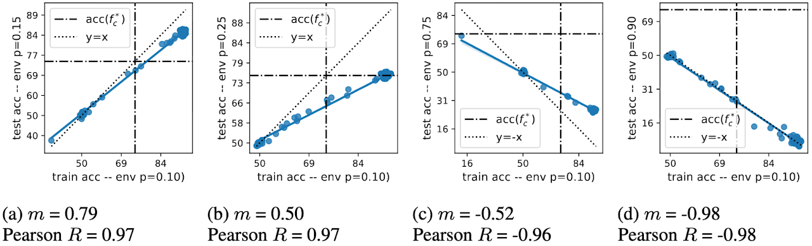

*NeurIPS 2024 Causal Representation Learning Workshop. Oral Presentation.*

{fig-alt="ColoredMNIST correlation plots"}

## A Quick Intuition: Causal vs Spurious Features

Imagine we train a model on an MNIST dataset where color correlates with label (e.g., red means "digits > 5"). If that correlation flips in a new environment, a model that understands the true causal features---the digits---should still generalize. A model that just learned to use color as a shortcut won't. It can fail spectacularly.

This is the core tension:

- **Causal features**: reflect mechanisms that truly govern the outcome
- **Spurious features**: correlate with the outcome only in a specific context

Domain generalization benchmarks are often treated as evidence tests for causal representation learning. The underlying assumption is simple: if a model performs better out of distribution across a small set of shifted environments, it must be relying on causal features rather than spurious ones. However, this assumption only holds if the domain shifts actually disrupt spurious correlations. When they do not, improved OOD performance can arise without any causal reasoning at all. Understanding when---and whether---domain generalization benchmarks truly enforce this distinction is the focus of our study.

## When DG Does Signal Causal Learning

We derive theoretical conditions under which a DG benchmark can reliably differentiate between causal and non-causal models. In essence, for DG to be a good proxy for causal learning:

- **Spurious correlations must reverse across environments.** That is, some patterns that helped in training should hurt in testing.
- **The signal-to-noise of spurious features must shrink** in the new environment. If the spurious signal is aligned and sufficiently strong, the shortcut can still thrive in new environments.

## Accuracy on the (Wrong) Line as a Test

A striking empirical fact is that many widely used domain generalization benchmarks exhibit accuracy on the line, where ID and OOD accuracy are nearly linear across models. Turns out that accuracy on the line is a test for the types of datasets we want to avoid for evaluating causal representation learning.

Here's the twist:

> Benchmark with accuracy on the line = Benchmark that cannot evaluate causal learning

Only in rare configurations do domain generalization benchmarks produce an inverse line---where a model performs better OOD precisely because it ignores spurious features.

Spurious correlations are a real-world phenomenon that harm model performance, especially in safety-critical domains. Causal representations are critical. However, the construction of benchmarks for methods that give causal representation requires nuance and care.

## What We Found in Popular DG Benchmarks

We went through a suite of standard datasets---ColoredMNIST, Camelyon17, PACS, TerraIncognita, and more---and here's what we saw:

- Many datasets show strong positive correlation between ID and OOD accuracy. That's the "accuracy on the line" pattern.
- Only a tiny sliver of configurations produce the inverse behavior that actually favors causal models.
- This suggests most benchmarks, as currently constructed, don't satisfy the theoretical conditions needed to judge causal representation learning.

Put differently: we think a lot of current DG tasks may be bad proxies for the very thing people want to use them to measure.

## What This Means for the Field

This isn't a call to abandon domain generalization---far from it. DG is a powerful idea, and we still believe it can be a meaningful tool for causal learning evaluation. But:

- **Benchmark design matters more than we thought.** It's not enough to shuffle domains---we need shifts that meaningfully break spurious signals.
- **Model selection based solely on held-out accuracy is misleading.** It can favor shrewd shortcut exploiters, not truly causal learners.
- **Aggregation across datasets can muddy conclusions.** Combining datasets that don't meet our criteria can produce a false sense of progress.

In short, progress requires not just better algorithms---but better benchmarks.

## Final Takeaway

If you care about causal learning---not just performance numbers---you should care deeply about how we evaluate models.

A dataset with accuracy on the line isn't doing what most of us think it's doing. Until benchmarks actually stress test causal inference, we risk optimizing models for illusions of robustness instead of true insight.

## Interested in the details?

- Read the full paper [here](https://openreview.net/pdf?id=LbFK9pUlA5)

### Cite

```bibtex
@inproceedings{salaudeen2024domain,
  title={On domain generalization datasets as proxy benchmarks for causal representation learning},
  author={Salaudeen, Olawale Elijah and Chiou, Nicole and Koyejo, Sanmi},
  booktitle={NeurIPS 2024 Causal Representation Learning Workshop},
  year={2024}
}
```
