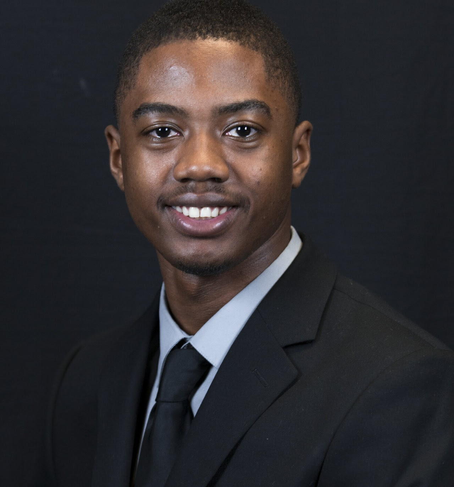

::: {.hero-header}

::: {.hero-photo}
<!-- TODO: Replace with your profile photo -->

:::

::: {.hero-identity}
[Olawale (Wale) Salaudeen]{.hero-name}

[AI Center Fellow in Residence, Schmidt Sciences • Postdoctoral Researcher, MIT and the Broad Institute of MIT and Harvard]{.hero-title}

[olawale [at] mit [dot] edu]{.hero-email}

::: {.hero-links}
[](mailto:olawale@mit.edu){aria-label="Email"}
[](https://scholar.google.com/citations?hl=en&user=F-ytPfAAAAAJ&view_op=list_works&sortby=pubdate){aria-label="Google Scholar"}
[](https://github.com/olawalesalaudeen){aria-label="GitHub"}
[](https://www.linkedin.com/in/olawalesalaudeen/){aria-label="LinkedIn"}
[](cv.qmd){aria-label="CV"}
:::

:::

:::

::: {.hero-bio}

::: {.job-market}
On the 2025–26 academic job market, seeking tenure-track positions beginning Fall 2026.\
[[CV](cv.qmd)]{.jm-links} [[Research Statement](#)]{.jm-links}
:::

::: {.hero-statement}
I work on AI for society through the science of valid measurement and prediction of AI capabilities and risks, and the development of methods to ensure their reliability under real-world conditions. This enables us to anticipate failures before deployment and ensure reliable behavior under real-world distribution shifts, with translational impact in domains such as healthcare.
:::

::: {.bio-tabs}

```{=html}
<input type="checkbox" id="biotab-1" class="bio-tabs-input"><label for="biotab-1" class="bio-tabs-label">Bio <span class="bio-wc">~250 words</span></label><input type="checkbox" id="biotab-2" class="bio-tabs-input"><label for="biotab-2" class="bio-tabs-label">Short Bio <span class="bio-wc">~175 words</span></label><input type="checkbox" id="biotab-3" class="bio-tabs-input"><label for="biotab-3" class="bio-tabs-label">Minimal Bio <span class="bio-wc">~75 words</span></label>
<script>
document.querySelectorAll('.bio-tabs-input').forEach(cb => {
  cb.addEventListener('change', () => {
    if (cb.checked) {
      document.querySelectorAll('.bio-tabs-input').forEach(other => {
        if (other !== cb) other.checked = false;
      });
    }
  });
});
</script>
```

::: {.bio-tabs-panel .bio-tabs-panel-1}

Olawale (Wale) Salaudeen is an AI Center Fellow in Residence at [Schmidt Sciences](https://www.schmidtsciences.org/), a Postdoctoral Researcher at [MIT](https://www.mit.edu/) (Healthy ML Lab, led by Prof. [Marzyeh Ghassemi](https://healthyml.org/)), and a Postdoctoral Scholar at the [Eric and Wendy Schmidt Center](https://www.ericandwendyschmidtcenter.org/) at the [Broad Institute of MIT and Harvard](https://www.broadinstitute.org/). Before his postdoctoral positions, he earned a Ph.D. in Computer Science from the [University of Illinois at Urbana-Champaign](https://cs.illinois.edu/) and the [Stanford Trustworthy AI Research (STAIR) Lab](https://stair.cs.stanford.edu/) at [Stanford University](https://www.stanford.edu/), advised by Prof. [Sanmi Koyejo](https://cs.stanford.edu/~sanmi/).

He works on AI for society through the science of valid measurement and prediction of AI capabilities and risks, and the development of methods to ensure their reliability under real-world conditions. This enables us to anticipate failures before deployment and ensure reliable behavior under real-world distribution shifts, with translational impact in domains such as healthcare.

He has received a Sloan Scholarship, a Beckman Graduate Research Fellowship, a GEM Associate Fellowship, and an NSF Miniature Brain Machinery Traineeship. He was recognized with a Best Paper Award at the NeurIPS 2025 Workshop on Evaluating the Evolving LLM Lifecycle, and was named a Top Area Chair at NeurIPS 2025. He has interned at Sandia National Laboratories (w/ Dr. Eric Goodman), Google Brain (w/ Dr. Alex D'Amour), Cruise LLC, and the [Max Planck Institute for Intelligent Systems](https://is.mpg.de/) (w/ Dr. [Moritz Hardt](https://mrtz.org/)).

He received a Bachelor of Science in Mechanical Engineering with minors in Computer Science and Mathematics from [Texas A&M University](https://www.tamu.edu/).

:::

::: {.bio-tabs-panel .bio-tabs-panel-2}

Olawale (Wale) Salaudeen is an AI Center Postdoctoral Fellow in Residence at [Schmidt Sciences](https://www.schmidtsciences.org/), a Postdoctoral Researcher at [MIT](https://www.mit.edu/) in the Healthy ML Lab led by Prof. [Marzyeh Ghassemi](https://healthyml.org/), and a Postdoctoral Scholar at the [Eric and Wendy Schmidt Center](https://www.ericandwendyschmidtcenter.org/) at the [Broad Institute of MIT and Harvard](https://www.broadinstitute.org/). He works on AI for society through the science of valid measurement and prediction of AI capabilities and risks, and the development of methods to ensure their reliability under real-world conditions. This enables us to anticipate failures before deployment and ensure reliable behavior under real-world distribution shifts, with translational impact in domains such as healthcare. He completed his Ph.D. in Computer Science at the [University of Illinois at Urbana-Champaign](https://cs.illinois.edu/) and the [Stanford STAIR Lab](https://stair.cs.stanford.edu/), advised by Prof. [Sanmi Koyejo](https://cs.stanford.edu/~sanmi/). His work has been supported by several honors, including the Sloan Scholarship, Beckman Graduate Research Fellowship, and GEM Associate Fellowship. He has interned at Google Brain, Cruise, and the [Max Planck Institute for Intelligent Systems](https://is.mpg.de/), and holds a B.S. in Mechanical Engineering from [Texas A&M University](https://www.tamu.edu/).

:::

::: {.bio-tabs-panel .bio-tabs-panel-3}

Olawale (Wale) Salaudeen is an AI Center Postdoctoral Fellow in Residence at [Schmidt Sciences](https://www.schmidtsciences.org/), a Postdoctoral Researcher at [MIT](https://www.mit.edu/) and the [Broad Institute of MIT and Harvard](https://www.broadinstitute.org/). He works on AI for society through the measurement and control of AI capabilities and risks. He earned his Ph.D. in Computer Science from the [University of Illinois at Urbana-Champaign](https://cs.illinois.edu/) and the [Stanford STAIR Lab](https://stair.cs.stanford.edu/).

:::

:::

:::

::: {.home-section}

## Selected Honors

Schmidt Sciences AI Center Fellowship • Best Paper, NeurIPS 2025 Workshop on Evaluating the Evolving LLM Lifecycle • NeurIPS 2025 Top Area Chair • NYU Tandon Faculty First-Look Fellow • Georgia Tech FOCUS Fellow • Sloan Scholarship • Beckman Graduate Research Fellowship • GEM Associate Fellowship • NSF Miniature Brain Machinery Traineeship • ICML 2022 Top Reviewer (10%)

:::

::: {.home-section}

## Selected Research Directions

My research develops the science of understanding, measuring, and improving the reliability of AI systems under real-world change. I work across three interconnected themes:

::: {.direction-grid}

::: {.direction-box}
### Valid Measurement and Prediction of AI Capabilities and Risks

AI systems exhibit jagged intelligence---they excel at some tasks but fail at others that share a common human capability. I develop measurements of AI-specific latent traits, capabilities, and risks to enable less jagged, more predictable behaviors across real-world settings.

::: {.direction-papers}
- [AI Construct Lexis](https://aiconstructlexis.github.io/)
- [Measurement to Meaning: A Validity-Centered Framework for AI Evaluation.](https://arxiv.org/abs/2505.10573) *In Review* [(preliminary in NeurIPS 2025 Workshop on Evaluating the Evolving LLM Lifecycle)]{.pub-note-info}
- [Toward an Evaluation Science for Generative AI Systems.](https://arxiv.org/abs/2503.05336) *The Bridge, NAE 2025*
- [ImageNot: A Contrast with ImageNet Preserves Model Rankings.](https://arxiv.org/abs/2404.02112) *TMLR 2026* [(To appear)]{.pub-note}
- [On Evaluating Methods vs. Evaluating Models.](publications.html#salaudeen2025methods) *NeurIPS 2025 Workshop on Evaluating the Evolving LLM Lifecycle* [(Best Paper)]{.pub-note}
:::
:::

::: {.direction-box}
### Characterizing and Intervening on Causal and Spurious Mechanisms of AI Behavior

AI systems often rely on spurious correlations, performing well in training environments but failing when conditions shift. My work identifies and disentangles causal from spurious mechanisms so models rely on stable, causal patterns instead.

::: {.direction-papers}
- [Aggregation Hides OOD Generalization Failures from Spurious Correlations.](https://arxiv.org/abs/2510.24884) *NeurIPS 2025* [(Spotlight)]{.pub-note}
- [Are Domain Generalization Benchmarks with Accuracy on the Line Misspecified?](https://arxiv.org/abs/2504.00186) *TMLR 2025* [(J2C)]{.pub-note} *+ ICLR 2026 Journal Track*
- [Causally Inspired Regularization Enables Domain General Representations.](https://arxiv.org/abs/2404.16277) *AISTATS 2024*
- [On Domain Generalization Datasets as Proxy Benchmarks for Causal Representation Learning.](publications.html#salaudeen2024proxy) *NeurIPS 2024 CRL Workshop* [(Oral)]{.pub-note}
:::
:::

::: {.direction-box}
### Inference-Time Adaptation of AI Systems

AI behaviors often become unreliable when deployment conditions change. I develop methods that use proxy variables and concept-based representations to adapt model behavior at inference time, without retraining.

::: {.direction-papers}
- [Adapting to Latent Subgroup Shifts via Concepts and Proxies.](https://proceedings.mlr.press/v206/alabdulmohsin23a.html) *AISTATS 2023*
- [Proxy Methods for Domain Adaptation.](publications.html#tsai2024proxy) *AISTATS 2024*
- [Improving Single-round Active Adaptation: A Prediction Variability Perspective.](publications.html#wang2025adaptation) *TMLR 2025*
:::
:::

:::

[See all publications →](publications.qmd){.section-link}

:::

::: {.home-section}

## Selected Recent News

:::{#news-feed}
:::

:::

```{=html}
<div class="home-section">
<h2>Fun Facts</h2>
<p>I was born in Nigeria and moved to Dallas, Texas at a young age. I played basketball and water polo in high school. I'm a loyal (if perpetually disappointed) Dallas sports fan, a cinephile, a social dancer (Latin and swing mostly), and a regular at live standup comedy. I'm full of hot takes, most of which I wouldn't die on, but am always eager to share and defend for fun. I also once won an intramural cornhole championship.</p>
</div>
```
